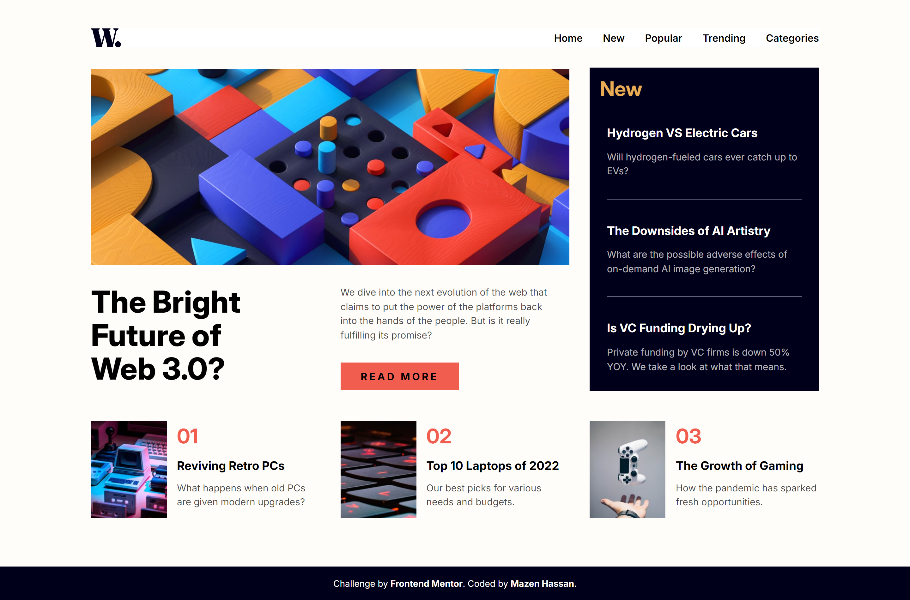

# Frontend Mentor - News homepage solution

This is a solution to the [News homepage challenge on Frontend Mentor](https://www.frontendmentor.io/challenges/news-homepage-H6SWTa1MFl). Frontend Mentor challenges help you improve your coding skills by building realistic projects.

## Table of contents

- [Frontend Mentor - News homepage solution](#frontend-mentor---news-homepage-solution)
  - [Table of contents](#table-of-contents)
  - [Overview](#overview)
    - [The challenge](#the-challenge)
    - [Screenshot](#screenshot)
    - [Links](#links)
    - [Built with](#built-with)
    - [What I learned](#what-i-learned)
    - [Continued development](#continued-development)
    - [Useful resources](#useful-resources)
  - [Acknowledgments](#acknowledgments)

## Overview

A grid based challenge for practicing proper grid placement and content alignment.

### The challenge

Users should be able to:

- View the optimal layout for the interface depending on their device's screen size
- See hover and focus states for all interactive elements on the page

### Screenshot

### Links

- Solution URL: [Solution URL](https://your-solution-url.com)
- Live Site URL: [Live site URL](https://mazz100.github.io/News-home-page/)

### Built with

- Semantic HTML5 markup
- CSS custom properties
- Flexbox
- CSS Grid
- Mobile-first workflow
- [Pre-processor](https://sass-lang.com/)

### What I learned

In this challenge I focused on improving my grid skills and implementing accessible mobile menu.

- Applying multiple grid display and maintaining responsiveness using `@mediaquery`
- Combining grid with flex when needed without breaking content alignment as a whole
- Implemented dialog element on mobile screen and used built-in `.showModal()` and `close()` to open / close menu
- Learned a new nesting selector `&` in SCSS which allows to target outer selector and applying CSS pseudo-classes easily

Extra accessiblilty concerned

- Visually hidden heading to better describe what the website is about

### Continued development

Grid display is very powerful and flexible when it's chosen in suitable cases, I want to get better at quickly palcing content with ease and decide when to wrap

### Useful resources

- [Dialog on MDN](https://developer.mozilla.org/en-US/docs/Web/HTML/Element/dialog) - A quick look into docs often is very helpful, this helped me on understanding how to properly implement dialog and it was simpler than expected.

## Acknowledgments

Great help from discord community and refactoring my code based on feedback always important. Thanks for the support.
